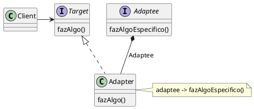
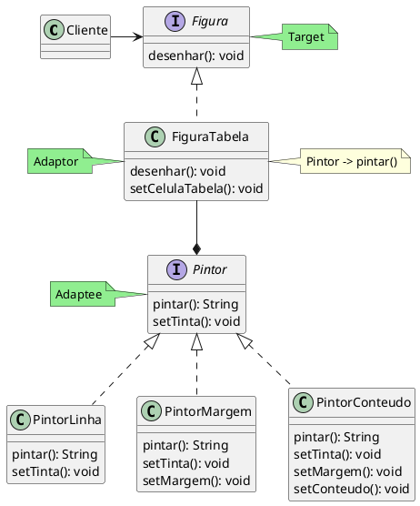

---
export_on_save:
  html: true
---

# Adpter (Padrão de Projeto Estrutural)

### Adaptando classes de construção de strings para gerar figuras no console
Exemplo feito pelo time do Object Pool

## Motivação
Durante o desenvolvimento de aplicações em que a utilização de classes é intercambiada através de interfaces, é comum que interfaces previamente incorporadas no projeto possam ser úteis em implementações futuras. Entretanto, novas implementações ou novos requisitos de clientes podem exigir *mudanças* em interfaces que já possuem um contrato prévio com outros modulos do projeto, ou então, utilizar interfaces de um *toolkit* externo pode ser conveniente para o desenvolvimento, mas como reaproveitar essas interfaces sem mudá-las diretamente e afetar as classes que as implementam?

Para este problema o Padrão Adapter propõe que estas interfaces reaproveitáveis **(adaptee)** sejam adaptadas para um novo contexto onde seus contratos serão traduzidos através uma interface adaptadora **(adapter)** sem que sofram mudanças diretamente. 



Para utilizar o padrão na linguagem Java, é feito uma *composição* dentro da classe **Adaptor** que referencia a classe **Adaptee** e utilizada uma implementação de sua interface de maneira que a adapte para o uso de um cliente.

Como exemplo, pense em uma aplicação que imprima figuras em um console, como tabelas de tamanhos, número de colunas e linhas variados. Para a implementação da *interface* ```Figura``` que o cliente terá acesso, há uma classe ```FiguraTabela``` que faz a adaptação de uma interface ```Pintor``` que, por sua vez, possui diferentes implementações com propósito específico de gerar *strings* de linha única, isto é, pintar uma fileira de caracteres. 


## Estrutura



## Participantes
- **Figura (Target)** 
  - Define a interface específica do domínio que ```Cliente``` usa.
- **FiguraTabela (Adaptor)**
  -  adapta a interface do ```Pintor``` à interface de ```Figura```.
- **Pintor (Adaptee)**
  - Define uma interface existente que necessita ser adaptada.
- **PintorLinha, PintorMargem, PintorConteudo**
  - Implementações de ```Pintor``` que realizam funções específicas diferentes.
- **Cliente**
  - Se comunica apenas e diretamente com a interface ```Figura``` e suas implementações.


## Implementação

### Figura (Target)
@import "./src/adapter/Figura.java"

### Pintor (Adaptee / Adaptado)
@import "./src/adaptee/Pintor.java"

### FiguraTabela (Adapter / Adaptador)
@import "./src/adapter/impl/FiguraTabela.java"

### PintorLinha
@import "./src/adaptee/impl/PintorLinha.java"

### PintorMargem
@import "./src/adaptee/impl/PintorMargem.java"

### PintorConteudo
@import "./src/adaptee/impl/PintorConteudo.java"

### AppGerarFiguras
@import "./src/AppGerarFiguras.java"

### Output

```
------------------------------------------
-            --            --            -
-   null     --   null     --   null     -
-            --            --            -
------------------------------------------
-            --            --            -
-   null     --   null     --   null     -
-            --            --            -
------------------------------------------
-            --            --            -
-   null     --   null     --   null     -
-            --            --            -
------------------------------------------
++++++++++++++++++++++++++++++++++++++++++++++++++++++++++++++++++++++++++++++
+                        ++                        ++                        +
+          um            ++        quatro          ++         sete           +
+                        ++                        ++                        +
++++++++++++++++++++++++++++++++++++++++++++++++++++++++++++++++++++++++++++++
+                        ++                        ++                        +
+         dois           ++         cinco          ++         oito           +
+                        ++                        ++                        +
++++++++++++++++++++++++++++++++++++++++++++++++++++++++++++++++++++++++++++++
+                        ++                        ++                        +
+         três           ++         seis           ++         nove           +
+                        ++                        ++                        +
++++++++++++++++++++++++++++++++++++++++++++++++++++++++++++++++++++++++++++++

```

## Aplicabilidade

Quando utilizar o padrão **Adapter**:
> * você quiser usar uma classe existente, mas sua interface não corresponder à interface de que necessita;
> * você quiser criar uma classe reutilizável que coopere com classes não-relacionadas ou não-previstas, ou seja, classes que não necessariamente tenham interfaces compatíveis;
> * (somente para adaptadores de objetos) você precisar usar várias subclasses existentes, porém, for impraticável adaptar essas interfaces criando subclasses para cada uma. Um adaptador de objeto pode adaptar a interface da sua classe-mãe.

## Colaborações
- Os clientes chamam operações em uma instância de FiguraTabela (Adapter). Por sua vez, o
adapter chama operações de Pintor (Adaptee) que executam a solicitação.